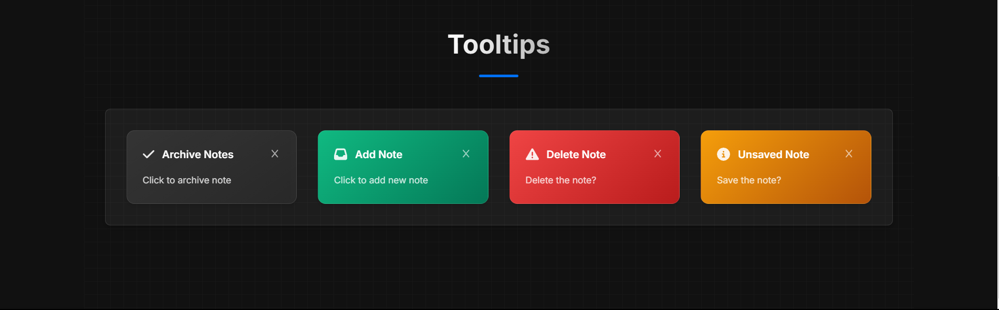

# Component Library 🎨

<div align="center">


A sleek and modern component library offering a rich collection of reusable UI elements designed to help you build beautiful, responsive, and accessible web interfaces.

[Features](#-features) • [Tech Stack](#-tech-stack) • [Installation](#-installation) • [Contributing](#-contributing) • [Screenshots](#-screenshots) • [Live](#-live) • [Author](#-author)

</div>

## 🎨 Features

- ⚙️ **Modular Components** - A variety of reusable, well-documented components.
- 🎨 **Customizable Themes** - Easily tailor component styles to fit your design needs.
- 📱 **Responsive Design** - Components that look great on any device.
- 🔧 **Developer Friendly** - Simple integration with your existing projects.
- 🌐 **Accessibility Focused** - Built with best practices to ensure a great user experience for all.
- 🚀 **Optimized Performance** - Lightweight and fast, perfect for modern web apps.

## 🛠 Tech Stack

### Frontend
- **[React](https://reactjs.org/)** - Building the interactive UI components.
- **[Vite](https://vitejs.dev/)** - Fast build tool and development server.
- **[Tailwind CSS](https://tailwindcss.com/)** - Utility-first CSS framework for rapid styling.
- **[TypeScript](https://www.typescriptlang.org/)** - Enhancing code quality with static typing.

### Deployment
- **[Vercel](https://vercel.com/)** - Seamless hosting and deployment.

## 🚀 Installation

1. **Clone the repository**

   ```bash
   git clone https://github.com/yourusername/component-library-inky.git
   cd component-library-inky
   ```
2. **Install dependencies**

    ```bash
    npm install
    ```

3. **Start the development server**

    ```bash
    npm run dev
    ```

**The application will be available at http://localhost:3000 (or as configured).**

## 🤝 Contributing

Contributions are welcome! Here's how you can help improve the Color Scheme Generator:

1. **Fork the repository**
2. **Create a feature branch:**

   ```bash
   git checkout -b feature/amazing-feature
   ```

3. **Commit your changes:**

   ```bash
   git commit -m 'Add some amazing feature'
   ```

4. **Push to the branch:**

   ```bash
   git push origin feature/amazing-feature
   ```

5. **Open a Pull Request.**

## 📸 Screenshots
<div align="center">

### **Badges**


### **Banners**


### **Cards**


### **Testimonial**


### **Tooltips**


</div>

## 🌐 Live

<div align="center">

[](https://component-library-inky.vercel.app/)

</div>

## 👤 Author

### Ashwin S Nambiar
- Portfolio: [ashwin-s-nambiar.is-a.dev](https://ashwin-s-nambiar.is-a.dev/)
- GitHub: [@Ashwin-S-Nambiar](https://github.com/Ashwin-S-Nambiar)

---

<div align="center">
Made with ❤️ by Ashwin S Nambiar
</div>